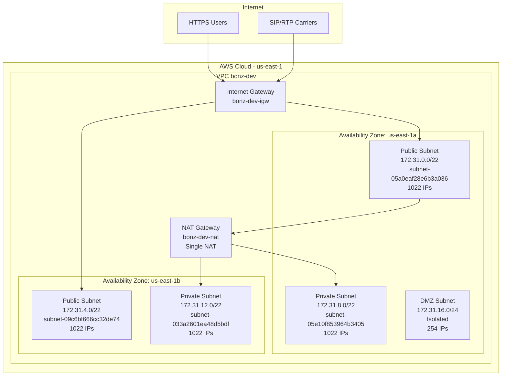
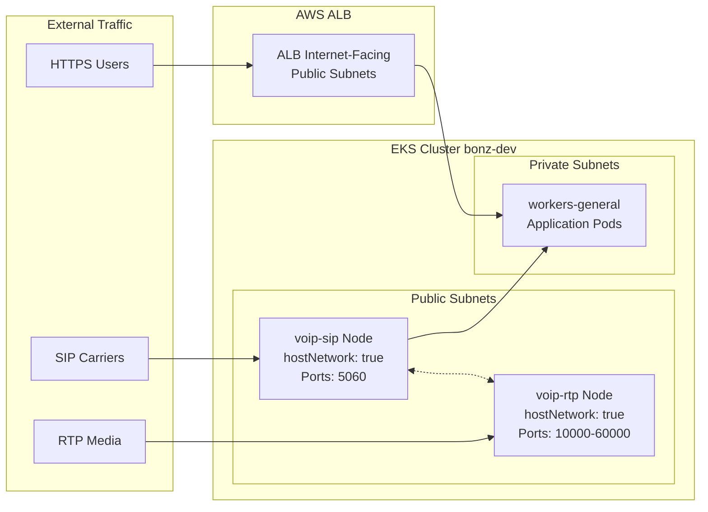

# AWS EKS Infrastructure - bonz-dev

## Overview

This document provides a complete reference of the AWS EKS infrastructure for the **bonz-dev** cluster, including VPC configuration, subnet details, node groups, and ingress controller setup.

---

## Network Architecture



---

## VPC Details

| Property | Value |
|----------|-------|
| **VPC Name** | `bonz-dev` |
| **VPC ID** | `vpc-0cd84a72adb38b35c` |
| **VPC CIDR** | `172.31.0.0/16` (65,536 IPs) |
| **Region** | `us-east-1` |
| **DNS Hostnames** | Enabled |
| **DNS Support** | Enabled |
| **Private Domain** | `bonz-dev.local` (Route53 Private Zone) |

---

## Subnet Configuration

### Public Subnets

| Name | Subnet ID | CIDR Block | Availability Zone | Purpose |
|------|-----------|------------|-------------------|---------|
| bonz-dev-public-us-east-1a | `subnet-05a0eaf28e6b3a036` | `172.31.0.0/22` | us-east-1a | VoIP nodes, ALB, Control Plane |
| bonz-dev-public-us-east-1b | `subnet-09c6bf666cc32de74` | `172.31.4.0/22` | us-east-1b | VoIP nodes, ALB, Control Plane |

**Tags:**
- `kubernetes.io/role/elb = 1` (for AWS ALB Ingress Controller)

### Private Subnets

| Name | Subnet ID | CIDR Block | Availability Zone | Purpose |
|------|-----------|------------|-------------------|---------|
| bonz-dev-private-us-east-1a | `subnet-05e10f853964b3405` | `172.31.8.0/22` | us-east-1a | Worker nodes (general) |
| bonz-dev-private-us-east-1b | `subnet-033a2601ea48d5bdf` | `172.31.12.0/22` | us-east-1b | Worker nodes (general) |

**Tags:**
- `kubernetes.io/role/internal-elb = 1` (for internal load balancers)

### DMZ Subnets (Isolated)

| Name | CIDR Block | Availability Zone | Purpose |
|------|------------|-------------------|---------|
| bonz-dev-dmz-us-east-1a | `172.31.16.0/24` | us-east-1a | Isolated resources (no internet) |

---

## EKS Cluster

| Property | Value |
|----------|-------|
| **Cluster Name** | `bonz-dev` |
| **Kubernetes Version** | `1.33` |
| **Cluster ARN** | `arn:aws:eks:us-east-1:324860463274:cluster/bonz-dev` |
| **API Endpoint** | `https://BB530BB5D7520470DD92B71B0BB6CD65.gr7.us-east-1.eks.amazonaws.com` |
| **Control Plane Tier** | Standard |
| **Control Plane Subnets** | Public (us-east-1a, us-east-1b) |

### EKS Add-ons

| Add-on | Version | Purpose |
|--------|---------|---------|
| vpc-cni | v1.20.5-eksbuild.1 | Pod networking |
| coredns | v1.12.4-eksbuild.1 | DNS resolution |
| kube-proxy | v1.33.5-eksbuild.2 | Network proxy |
| aws-ebs-csi-driver | v1.53.0-eksbuild.1 | EBS volume provisioning |
| eks-pod-identity-agent | v1.3.10-eksbuild.1 | IAM Pod Identity |

---

## Node Groups

### workers-general (Private Subnets)

| Property | Value |
|----------|-------|
| **Name** | `workers-general` |
| **Subnets** | Private (subnet-05e10f853964b3405, subnet-033a2601ea48d5bdf) |
| **Scaling** | Min: 1, Max: 5, Desired: 2 |
| **AMI** | AL2023_x86_64_STANDARD |
| **Storage** | 50GB gp3 (encrypted) |

**Instance Types (Mixed Policy):**
- `t3.small`
- `c7i-flex.large`
- `m7i-flex.xlarge`

**Spot Configuration:**
- On-Demand Base: 1
- Above Base: 25% On-Demand, 75% Spot
- Strategy: capacity-optimized

**Labels:**
```yaml
workload: general
environment: dev
lifecycle: mixed
```

**Taints:**
```yaml
- key: dedicated
  value: general
  effect: NoSchedule
```

---

### voip-sip (Public Subnets - SIP Signaling)

| Property | Value |
|----------|-------|
| **Name** | `voip-sip` |
| **Subnets** | Public (subnet-05a0eaf28e6b3a036, subnet-09c6bf666cc32de74) |
| **Scaling** | Min: 1, Max: 1, Desired: 1 |
| **Instance Type** | `c7i-flex.large` |
| **AMI** | AL2023_x86_64_STANDARD |
| **Public IP** | Yes (required for SIP) |
| **Storage** | 50GB gp3 (encrypted) |

**Labels:**
```yaml
voip-environment: sip
workload: voip-edge
network: public
```

**Taints:**
```yaml
- key: voip-environment
  value: sip
  effect: NoSchedule
```

**Security Group Ingress:**
| Port | Protocol | CIDR | Description |
|------|----------|------|-------------|
| 5060 | UDP | 0.0.0.0/0 | SIP signaling UDP |
| 5060 | TCP | 0.0.0.0/0 | SIP signaling TCP |
| 5061 | TCP | 0.0.0.0/0 | SIP over TLS |
| 9022 | TCP | 172.17.0.0/16 | drachtio admin (internal) |

---

### voip-rtp (Public Subnets - RTP Media)

| Property | Value |
|----------|-------|
| **Name** | `voip-rtp` |
| **Subnets** | Public (subnet-09c6bf666cc32de74, subnet-05a0eaf28e6b3a036) |
| **Scaling** | Min: 1, Max: 1, Desired: 1 |
| **Instance Type** | `c7i-flex.large` |
| **AMI** | AL2023_x86_64_STANDARD |
| **Public IP** | Yes (required for RTP) |
| **Storage** | 100GB gp3 (encrypted) |

**Labels:**
```yaml
voip-environment: rtp
workload: voip-edge
network: public
```

**Taints:**
```yaml
- key: voip-environment
  value: rtp
  effect: NoSchedule
```

**Security Group Ingress:**
| Port | Protocol | CIDR | Description |
|------|----------|------|-------------|
| 10000-60000 | UDP | 0.0.0.0/0 | RTP media streams |
| 22222 | TCP | 172.17.0.0/16 | rtpengine NG control (internal) |
| 22223 | UDP | 172.17.0.0/16 | rtpengine sidecar DTMF (internal) |

---

## AWS Load Balancer Controller (ALB Ingress)

For HTTPS traffic routing, the AWS Load Balancer Controller will be installed to manage Application Load Balancers.

### Subnet Requirements

| Subnet Type | Tag | Purpose |
|-------------|-----|---------|
| Public | `kubernetes.io/role/elb = 1` | Internet-facing ALB |
| Private | `kubernetes.io/role/internal-elb = 1` | Internal ALB |

### Ingress Configuration

```yaml
apiVersion: networking.k8s.io/v1
kind: Ingress
metadata:
  name: example-ingress
  annotations:
    kubernetes.io/ingress.class: alb
    alb.ingress.kubernetes.io/scheme: internet-facing
    alb.ingress.kubernetes.io/target-type: ip
    alb.ingress.kubernetes.io/subnets: subnet-05a0eaf28e6b3a036,subnet-09c6bf666cc32de74
    alb.ingress.kubernetes.io/certificate-arn: <ACM_CERTIFICATE_ARN>
    alb.ingress.kubernetes.io/listen-ports: '[{"HTTPS":443}]'
    alb.ingress.kubernetes.io/ssl-redirect: '443'
spec:
  rules:
    - host: app.bonz-dev.local
      http:
        paths:
          - path: /
            pathType: Prefix
            backend:
              service:
                name: my-service
                port:
                  number: 80
```

---

## Traffic Flow Diagram



---

## Quick Reference

### Subnet IDs for Terraform/Helm

```hcl
# Public Subnets (ALB, VoIP nodes)
public_subnet_ids = [
  "subnet-05a0eaf28e6b3a036",  # us-east-1a - 172.31.0.0/22
  "subnet-09c6bf666cc32de74",  # us-east-1b - 172.31.4.0/22
]

# Private Subnets (Worker nodes, Internal ELB)
private_subnet_ids = [
  "subnet-05e10f853964b3405",  # us-east-1a - 172.31.8.0/22
  "subnet-033a2601ea48d5bdf",  # us-east-1b - 172.31.12.0/22
]

# VPC
vpc_id = "vpc-0cd84a72adb38b35c"
```

### kubectl Access

```bash
# Update kubeconfig
aws eks update-kubeconfig --region us-east-1 --name bonz-dev --profile suadmin

# Verify connection
kubectl get nodes
```

### Node Selector Examples

```yaml
# Schedule on general workers (tolerate dedicated taint)
nodeSelector:
  workload: general
tolerations:
  - key: dedicated
    value: general
    effect: NoSchedule

# Schedule on SIP nodes
nodeSelector:
  voip-environment: sip
tolerations:
  - key: voip-environment
    value: sip
    effect: NoSchedule

# Schedule on RTP nodes
nodeSelector:
  voip-environment: rtp
tolerations:
  - key: voip-environment
    value: rtp
    effect: NoSchedule
```

---

## AWS Account Details

| Property | Value |
|----------|-------|
| **AWS Account ID** | `324860463274` |
| **AWS Profile** | `suadmin` |
| **Region** | `us-east-1` |

